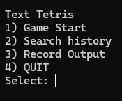
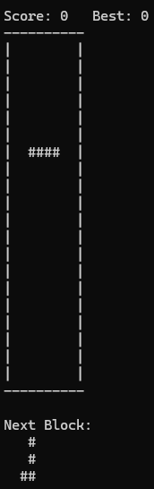

# 🎮 Text Tetris

> **C언어 기반 터미널 테트리스 게임 구현 프로젝트**  
> 자료구조와 콘솔 입출력 처리를 활용하여 터미널 환경에서 동작하는 테트리스 게임을 구현했습니다.

---

## 📌 Project Overview

**Text Tetris**는 C언어로 구현한 터미널 기반 테트리스 게임입니다.

본 프로젝트는 자료구조 수업의 텀 프로젝트로 진행되었으며,  
제공된 기본 소스 코드를 기반으로 테트리스 게임의 핵심 기능을 구현하는 것을 목표로 했습니다.

게임은 터미널 화면에서 동작하며, 사용자는 키보드 입력을 통해 블럭을 이동, 회전, 낙하시킬 수 있습니다.  
또한 게임 종료 후 점수를 기록하고, 저장된 기록을 출력하거나 이름으로 검색할 수 있도록 구현했습니다.

---

## 🖼️ Preview

### Menu Screen

<p align="center">
  
</p>

<p align="center">
  <em>Text Tetris main menu</em>
</p>

### Game Screen

<p align="center">
  
</p>

<p align="center">
  <em>Gameplay screen with score, board, and next block preview</em>
</p>

---

## 🎯 Project Goal

본 프로젝트의 주요 목표는 다음과 같습니다.

- C언어 기반 터미널 게임 구현
- 테트리스 보드 및 블럭 출력
- 7종 테트리스 블럭 구현
- 블럭 이동, 회전, 낙하 기능 구현
- 충돌 검사 및 블럭 고정 처리
- 라인 삭제 및 점수 계산
- 자동 낙하 기능 구현
- 게임 기록 저장 및 검색 기능 구현
- Windows / Linux 환경을 고려한 입력 처리

---

## 🛠️ Development Environment

| Category | Description |
|---|---|
| Language | C |
| Build Tool | Makefile |
| Compiler | GCC / MinGW |
| Platform | Windows, Linux |
| Interface | Terminal / Console |

---

## ⚙️ Build & Run

### 1. Build

프로젝트는 `makefile`을 통해 컴파일할 수 있습니다.

```bash
make
```

Windows 환경에서 MinGW를 사용하는 경우:

```bash
mingw32-make
```

---

### 2. Run

컴파일 후 다음 명령어로 실행합니다.

```bash
./tetris
```

또는 Windows 환경에서는 생성된 실행 파일을 실행합니다.

```bash
tetris.exe
```

---

## 🧩 Game Rule

게임은 일반적인 테트리스 규칙을 따릅니다.

- 블럭은 위에서 아래로 떨어집니다.
- 사용자는 블럭을 좌우로 이동하거나 회전할 수 있습니다.
- 블럭이 바닥 또는 다른 블럭에 닿으면 고정됩니다.
- 한 줄이 모두 채워지면 해당 라인은 삭제됩니다.
- 라인이 삭제되면 점수가 증가합니다.
- 블럭이 더 이상 생성될 수 없으면 게임이 종료됩니다.

---

## 🧱 Board Structure

게임 보드는 2차원 배열로 관리했습니다.

```c
#define ROW 21
#define COL 10

static char tetris_table[ROW][COL];
```

보드는 다음 문자로 구성됩니다.

| Symbol | Description |
|---|---|
| `#` | 블럭 |
| `|` | 좌우 벽 |
| `-` | 바닥 및 상단 구분선 |
| 공백 | 빈 공간 |

초기 보드는 `init_board()` 함수에서 생성되며,  
좌우 벽과 바닥을 먼저 배치한 뒤 빈 공간을 채우는 방식으로 구현했습니다.

---

## 🧱 Block System

테트리스 블럭은 4x4 배열을 기반으로 구현했습니다.

총 7종의 블럭을 사용합니다.

| Block | Description |
|---|---|
| I_BLOCK | I 블럭 |
| T_BLOCK | T 블럭 |
| S_BLOCK | S 블럭 |
| Z_BLOCK | Z 블럭 |
| L_BLOCK | L 블럭 |
| J_BLOCK | J 블럭 |
| O_BLOCK | O 블럭 |

각 블럭은 회전 상태별 4개의 4x4 배열로 구성했습니다.

```c
#define BLOCK_SIZE 4
```

블럭 목록은 포인터 배열로 관리하여,  
현재 블럭 번호와 회전 상태에 따라 필요한 블럭 모양을 참조하도록 구현했습니다.

---

## 🎮 Controls

게임 조작 키는 다음과 같습니다.

| Key | Function |
|---|---|
| `j` / `J` | 왼쪽으로 이동 |
| `l` / `L` | 오른쪽으로 이동 |
| `k` / `K` | 아래로 한 칸 이동 |
| `i` / `I` | 시계 방향 90도 회전 |
| `a` / `A` | 즉시 낙하 |
| `p` / `P` | 게임 종료 |

대문자와 소문자 입력이 모두 동작하도록 구현했습니다.

---

## 🧠 Core Features

### 1. Game Menu

프로그램 실행 시 메뉴 화면을 출력합니다.

```text
Text Tetris
1) Game Start
2) Search history
3) Record Output
4) QUIT
```

메뉴를 통해 다음 기능을 선택할 수 있습니다.

- 게임 시작
- 기록 검색
- 전체 기록 출력
- 프로그램 종료

---

### 2. Block Movement

사용자 입력에 따라 현재 블럭의 위치를 변경합니다.

- 왼쪽 이동
- 오른쪽 이동
- 아래 이동
- 회전
- 즉시 낙하

이동 전에는 `can_move()` 함수를 통해 이동 가능한 위치인지 먼저 검사합니다.

```c
int can_move(int nx, int ny, int nr);
```

벽, 바닥, 기존 블럭과 충돌하는 경우 해당 이동은 수행되지 않습니다.

---

### 3. Collision Detection

블럭 이동 및 회전 시 충돌 검사를 수행합니다.

충돌 검사는 다음 상황을 확인합니다.

- 보드 범위를 벗어나는 경우
- 좌우 벽에 닿는 경우
- 바닥에 닿는 경우
- 이미 고정된 블럭과 겹치는 경우

충돌이 발생하지 않는 경우에만 이동 또는 회전이 적용됩니다.

---

### 4. Block Fixing

블럭이 더 이상 아래로 이동할 수 없으면 현재 위치에 고정됩니다.

```c
void fix_block(void);
```

고정된 블럭은 `tetris_table` 배열에 `#` 문자로 저장됩니다.

---

### 5. Line Clear

한 줄이 모두 블럭으로 채워지면 해당 라인을 삭제합니다.

```c
void clear_lines(void);
```

라인 삭제 시 위쪽 줄들을 아래로 한 칸씩 내리고,  
점수를 증가시킵니다.

```c
#define LINE_SCORE 100
```

라인 하나를 삭제할 때마다 100점이 추가되도록 구현했습니다.

---

### 6. Automatic Falling

블럭은 사용자의 키 입력과 관계없이 일정 시간마다 자동으로 아래로 이동합니다.

```c
const int fall_interval = 500;
```

`get_millisec()` 함수를 통해 시간을 측정하고,  
마지막 낙하 시점과 현재 시점을 비교하여 자동 낙하를 처리했습니다.

이 구조를 통해 사용자가 키를 입력하지 않아도 게임이 계속 진행되도록 구현했습니다.

---

### 7. Next Block Preview

현재 블럭뿐만 아니라 다음에 등장할 블럭도 화면에 출력합니다.

```text
Next Block:
```

다음 블럭은 `next_block_number` 변수로 관리하며,  
새 블럭이 생성될 때 다음 블럭 번호를 현재 블럭으로 넘기고 새로운 다음 블럭을 랜덤으로 생성합니다.

---

### 8. Score & Best Score

현재 점수와 최고 점수를 화면 상단에 출력합니다.

```text
Score: 0   Best: 0
```

최고 점수는 저장된 기록 파일을 읽어 가장 높은 점수를 찾아 표시합니다.

---

## 🗂️ Record System

게임 종료 후 사용자의 이름과 점수를 기록합니다.

기록은 다음 파일에 저장됩니다.

```c
#define RECORD_FILE "tetris_records.txt"
```

저장되는 정보는 다음과 같습니다.

- 이름
- 점수
- 날짜
- 시간

예시:

```text
HyeonWoo 300 2025-06-17 22:30
```

---

## 🔍 Record Search

메뉴에서 `Search history`를 선택하면 이름을 기준으로 기록을 검색할 수 있습니다.

```c
void search_result(void);
```

검색 결과에는 다음 정보가 출력됩니다.

- 이름
- 점수
- 날짜
- 시간
- 순위

---

## 🏆 Ranking System

저장된 기록은 점수 기준으로 정렬됩니다.

```c
qsort(recs, count, sizeof(result), cmp_point);
```

점수가 높은 순서대로 순위를 부여하며,  
동점자의 경우 같은 순위를 갖도록 구현했습니다.

---

## 💻 Cross-platform Input Handling

운영체제별로 입력 처리 방식이 다르기 때문에 Windows와 POSIX 계열 환경을 구분하여 처리했습니다.

### Windows

Windows 환경에서는 다음 헤더를 사용했습니다.

```c
#include <conio.h>
#include <windows.h>
```

입력 확인과 시간 지연에는 다음 함수를 사용했습니다.

- `_kbhit()`
- `Sleep()`
- `GetTickCount()`

---

### Linux / macOS

POSIX 계열 환경에서는 다음 헤더를 사용했습니다.

```c
#include <unistd.h>
#include <termios.h>
#include <sys/time.h>
#include <sys/select.h>
```

입력 처리를 위해 터미널 설정을 변경했습니다.

- Canonical mode 비활성화
- Echo 비활성화
- `select()` 기반 비동기 입력 확인
- `read()` 기반 문자 입력 처리

이를 통해 터미널에서 키 입력을 기다리지 않고도 자동 낙하가 동작하도록 구현했습니다.


---

## ✅ Implemented Features

- [x] 터미널 기반 테트리스 보드 출력
- [x] 7종 블럭 구현
- [x] 블럭 랜덤 생성
- [x] 다음 블럭 미리보기
- [x] 좌우 이동
- [x] 아래 이동
- [x] 블럭 회전
- [x] 즉시 낙하
- [x] 자동 낙하
- [x] 충돌 검사
- [x] 블럭 고정
- [x] 라인 삭제
- [x] 점수 계산
- [x] 최고 점수 표시
- [x] 기록 저장
- [x] 기록 검색
- [x] 전체 기록 출력
- [x] 랭킹 계산
- [x] Windows / Linux 입력 처리

---

## 🧠 What I Learned

이 프로젝트를 통해 C언어 기반 콘솔 프로그램에서 실시간 입력 처리와 화면 갱신을 어떻게 구현하는지 경험할 수 있었습니다.

특히 테트리스는 단순히 블럭을 출력하는 것뿐만 아니라,  
블럭의 위치, 회전 상태, 충돌 여부, 보드 상태, 점수, 기록 저장 등 여러 상태를 동시에 관리해야 하는 프로그램이었습니다.

또한 사용자의 키 입력이 없어도 블럭이 자동으로 떨어져야 했기 때문에,  
입력 처리와 시간 기반 자동 동작을 분리하여 구현하는 것이 중요하다는 점을 배웠습니다.

운영체제별로 키 입력과 터미널 제어 방식이 다르기 때문에,  
Windows와 POSIX 계열 환경을 나누어 입력 처리 로직을 구성한 점도 중요한 구현 경험이었습니다.

---

## 📚 Keywords

- C
- Data Structure
- Tetris
- Terminal Game
- Console Programming
- Non-blocking Input
- kbhit
- termios
- select
- File I/O
- Ranking System
- Cross-platform
